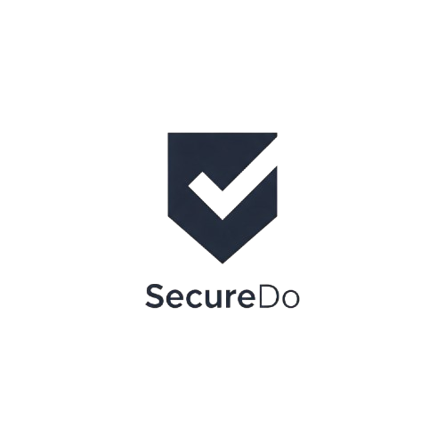

<p align="center">
  
</p>

# SecureDo: Your Private Task Manager

SecureDo is a privacy-focused task management app that keeps your personal tasks and habits completely secure on your device. Unlike cloud-based solutions, SecureDo prioritizes your privacy by storing all data locally.

## Key Features

### 🔒 Privacy-First Architecture
- **100% On-Device Storage**: All your tasks, details, and analytics are stored securely on your device
- **No Cloud Sync**: Your data never leaves your device, eliminating cloud security risks
- **No Account Required**: Start using the app immediately without sharing any personal information

### ✅ Task Management
- Create and manage daily tasks
- Add detailed notes and images to tasks
- Swipe-to-delete functionality
- Visual completion indicators
- Calendar view for task organization

### 📊 Private Analytics
- Track completion rates
- View 7-day activity patterns
- Monitor total and completed task statistics
- All analytics computed locally for maximum privacy

### 🎯 Smart Features
- Recommended tasks for quick setup
- Task categorization
- Visual progress tracking
- Celebration animations for completed tasks

### 📱 User Experience
- Clean, minimalist interface
- Dark theme for reduced eye strain
- Smooth animations and transitions
- Bottom tab navigation for easy access
- Responsive design for all screen sizes

### 📄 Task Details
- Add detailed notes to tasks
- Attach images securely
- Export task details as PDF
- Share task information selectively

## Privacy & Security Benefits

### Why Local Storage Matters
- **Data Control**: You have complete control over your personal information
- **Offline Access**: Access your tasks anytime, even without internet
- **No Data Breaches**: Your data can't be compromised in server breaches
- **No Third-Party Access**: Your tasks remain private to you
- **GDPR Compliant**: No personal data collection or processing

### Technical Security
- Secure local storage implementation
- Protected file system access
- Private image handling
- Secure PDF generation for sharing

## Getting Started

1. Install dependencies:
```bash
npm install
```

2. Start the app:
```bash
npx expo start
```

## Privacy Policy
SecureDo is committed to your privacy. We don't:
- Collect personal information
- Track usage data
- Require internet access
- Share any data with third parties

## Contributing
We welcome contributions that enhance privacy and security. Please ensure any contributions maintain our strict privacy-first approach.

## License
MIT License - See LICENSE file for details

---

<p align="center">
Built with privacy in mind. Your tasks, your device, your data.
</p>
